<h1 align="center">Hi, I'm Abbas 👋</h1>

<p align="center">
  
</p>

<p align="center">
  📍 江西宜春 · Building Android apps with clean architecture
</p>

---

### About

Android 开发者，专注于构建结构清晰、可维护的移动应用。  
目前在深入学习 **Dagger2** 与依赖注入实践，也喜欢和志同道合的人一起写代码。

```kotlin
val developer = Developer(
    name = "Abbas",
    focus = listOf("Android", "Kotlin", "Java"),
    learning = "Dagger2",
    location = "Jiangxi, China"
)
```

---

### Tech Stack

<p align="left">
  
</p>

<p align="left">
  
  
  
  
</p>

---

### GitHub Stats

<p align="center">
  
  
</p>

<p align="center">
  
</p>

<p align="center">
  
</p>

---

### Featured Projects

| Project | Description | Stack |
| :--- | :--- | :--- |
| [**Wps-ADB-Tool**](https://github.com/Abdulla-abs/Wps-ADB-Tool) | ADB tool for WPS Studio | `Kotlin` |
| [**Translator**](https://github.com/Abdulla-abs/Translator) | Cross-platform translator built with KMP | `Kotlin` `KMP` |
| [**Sokoban**](https://github.com/Abdulla-abs/Sokoban) | Classic Sokoban game for Android | `Java` `Room` `MVI` |
| [**game-controller**](https://github.com/Abdulla-abs/game-controller) | Game controller component for Compose | `Kotlin` `Compose` |

---

### Connect

<!-- 将下方链接替换为你的真实联系方式 -->
<p align="left">
  <a href="mailto:qizhiwang339@gmail.com">
    
  </a>
  <a href="https://blog.csdn.net/qq_49757305?type=blog" target="_blank">
    
  </a>
  <!-- <a href="https://linkedin.com/in/your-profile" target="_blank">
    
  </a> -->
  <a href="https://github.com/Abdulla-abs" target="_blank">
    
  </a>
</p>

---

<p align="center">
  
</p>

<p align="center">
  <i>志同道合的人，很有魅力。</i>
</p>
